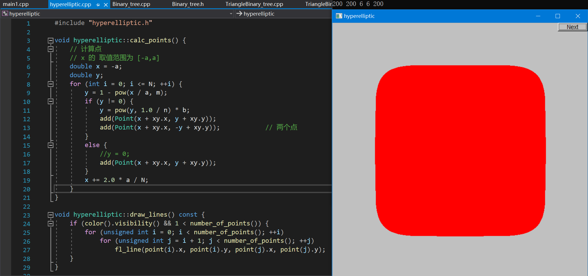

# ProblemSolving-Assignments

问题求解与实践课程 作业代码 自用
- Week 01 为试验作业。
- Week 02 ~ Week 10 为 educoder 上的评测作业。其中 Week 08 和 Week 09 使用了 FLTK 库，为手动判定。
- Week 11 为课堂作业，因为对题意理解有巨大偏差，未通过，请不要参考。
- 大作业在 GraphGenDecomp 存储库中。

A work worth 200W: [Week08](./Week08/FLTKUseAndDesign/FLTK1/1/hyperelliptic.cpp)

